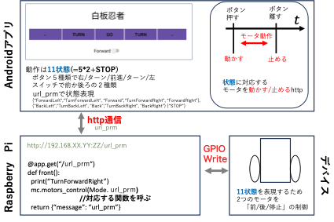

# white_sweeper
# OverView　"white_sweeper"

"white_sweeper","白板忍者"はホワイトボードの文字をAndroid Appで制御するロボットデバイスで消すことができるシステムです．

# Features
自動で消すことができるため， 「立ち上がる必要がない」，「腕を動かさなくて良い」，「楽しく操作」といった利点があります．

# Installation :balloon:
## Android App
Android Studioでこのリポジトリをcloneします．

## サーバ
`Python` `Fast API`によって実装され，２つのファイルによって実行されます

# Author
チーム開発
